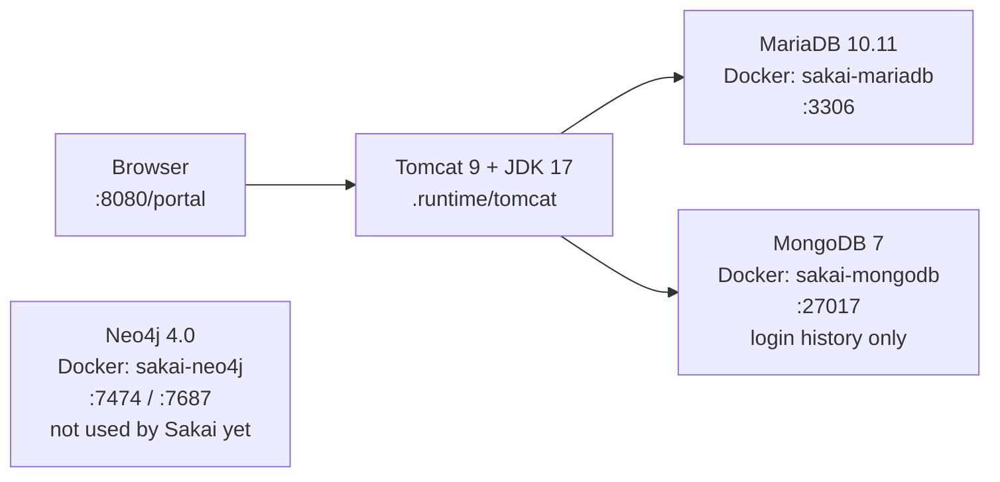
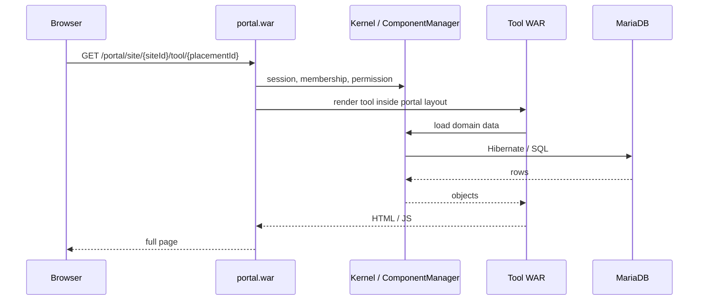

# How a page is served

This page follows **one request** from the browser through Tomcat to the database. User-facing words (portal, site, tool) are in [overview](overview.md).

Sakai runs **inside Tomcat on the host**. Docker runs **MariaDB** (all LMS data), **MongoDB** (login history only), and **Neo4j 4.0** (started for local use; Sakai code does not talk to it yet).



## One URL

A typical page is the **portal wrapping a tool**.



Kernel services are registered in Spring XML under `components/*/WEB-INF/` and looked up through Sakai’s **ComponentManager**. If that Spring context fails (`SakaiApplicationContext has not been refreshed yet`), every tool fails and `/portal` shows a generic error.

## What Tomcat actually contains

A **WAR** (Web Application Archive) is one Java web module. Most UI tools compile to `*.war` under Tomcat `webapps/`. Copying WARs alone is **not** a full Sakai install. You also need components, shared libraries, `sakai.properties`, JDK, Tomcat, and the database.

```text
.runtime/tomcat/apache-tomcat-9.0.122/
  webapps/          ← tool and portal WARs (URLs)
  components/       ← kernel and service packs (not hit as URLs)
  lib/              ← shared JARs (Spring, Hibernate, MariaDB driver, …)
  sakai/            ← sakai.properties (DB URL, local flags)
  logs/catalina.out ← startup and runtime log
```

## Cache: one Tomcat

Sakai uses **Apache Ignite** as a cache. A **second** Tomcat on the same machine often fails Ignite discovery (`same hash code for partitioned affinity`) and/or bind on shutdown port **8005**. Run **one** instance: `stop.cmd` before `start.cmd`.

## Database

**Hibernate** maps Java entities to **SQL tables**. This local setup uses **MariaDB**. HSQLDB is still in the tree historically but is **not** reliable for a full boot here (Quartz `JOB_DATA` truncation). **MongoDB** is used only for login history (see [login-p12-mongodb.md](login-p12-mongodb.md)). **Neo4j 4.0** is started by `start.cmd` but not wired into Sakai. Search can use OpenSearch; local config typically has `search.enable=false`.

Next: [where this lives in the source tree](directory-structure.md).
