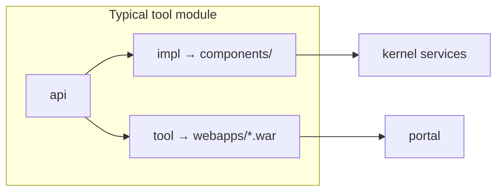

# Where the code lives

Root `pom.xml` is a Maven aggregator: it builds many modules. Most folders are **LMS tools**. A few folders are the **platform** (versions, kernel, portal, deploy).

## Typical tool

A tool is usually three Maven modules:

- **`api/`** — interfaces other modules compile against
- **`impl/`** — service implementation, deployed under Tomcat `components/`
- **`tool/`** — UI, packaged as a **WAR** under Tomcat `webapps/`

UI stacks vary (Velocity, JSF, Wicket, RSF, plus newer Lit and Vue in `webcomponents/` and `vuecomponents/`). The folder shape above is what to look for first.

## Platform folders

| Path | Role |
| --- | --- |
| `master/` | Parent POM: JDK, Tomcat, Spring, Hibernate, dependency versions |
| `kernel/` | Users, sites, authz, files, events, ComponentManager |
| `portal/` | Main UI shell (`/portal`) |
| `config/` | Default `sakai.properties`, i18n, kernel config |
| `deploy/` | Copies shared JARs into Tomcat `lib/` |
| `library/` | Skin, CKEditor, shared web assets |
| `webcomponents/`, `vuecomponents/` | JS UI packages bundled into WARs |
| `webapi/`, `webservices/`, `entitybroker/` | HTTP APIs used by tools |
| `providers/` | Optional auth / LDAP / similar |
| `login/`, `login-history/`, `user/`, `profile2/`, `reset-pass/` | Sign-in, accounts; `login-history` writes login attempts to MongoDB |
| `site/`, `site-manage/` | Site administration |
| `docker/` | Upstream all-in-one image example (not this local run) |
| `.runtime/` | Local JDK, Maven, Tomcat, DB data (gitignored; from `setup.cmd`) |
| `offline-kit/` | Compressed runtime in-repo; `setup.cmd` unpacks to `.runtime/` |
| `docs/` | This folder |

## Tools (folder → what the user sees)

| Path | In the UI |
| --- | --- |
| `assignment/` | Assignments |
| `gradebookng/` | Gradebook |
| `samigo/` | Tests & Quizzes |
| `lessonbuilder/` | Lessons |
| `content/` | Resources |
| `announcement/` | Announcements |
| `msgcntr/` | Forums / messages |
| `calendar/` | Calendar |
| `chat/` | Chat |
| `syllabus/` | Syllabus |
| `roster2/` | Roster |
| `rubrics/` | Rubrics |
| `conversations/` | Conversations |
| `polls/`, `signup/`, `meetings/` | Polls, sign-up, meetings |
| `rwiki/` | Wiki |
| `dashboard/` | Dashboards |
| `sitestats/` | Site statistics |
| `scormplayer/` | SCORM |
| `lti/`, `plus/` | LTI / LMS interoperability |
| `admin-tools/`, `admin-su/` | Admin utilities / become-user |
| `jobscheduler/` | Scheduled jobs (Quartz) |
| `pasystem/` | Popup admin announcements |

Keep `.git` and `.runtime/` if you want to run without installing JDK, Maven, or Tomcat on Windows.

Next: [versions and what you can mix](versions.md).
