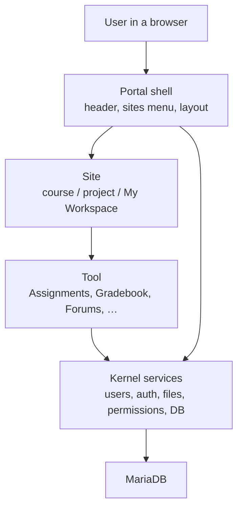

# What this project is

This repository is **Sakai CLE** (Collaboration and Learning Environment): a learning management system (LMS) in the same family as Moodle or Canvas. People open it in a **browser**. Nothing here is a desktop app.

Three processes run together (see the [setup guide](../Setup%20and%20Running%20Guide.md)):

- **Browser** — http://localhost:8080/portal
- **Apache Tomcat** on the host — runs the Sakai Java application (JDK 17)
- **MariaDB** in Docker — stores users, sites, files metadata, grades, and the rest

## Portal, sites, and tools

Sakai is a **portal of sites**. Each site is a **menu of tools**.

- **Portal** — the chrome around every page (header, site switcher, layout). The webapp is `portal`.
- **Site** — a container: a course, a project, or personal **My Workspace**.
- **Tool** — one feature placed in that site (Assignments, Gradebook, Forums, Resources, …).
- **Role** — what this user may do in that site (student, instructor, admin). Instructor and student share the **same** site; the role changes the actions.

Next: [how a page is served](architecture.md).
