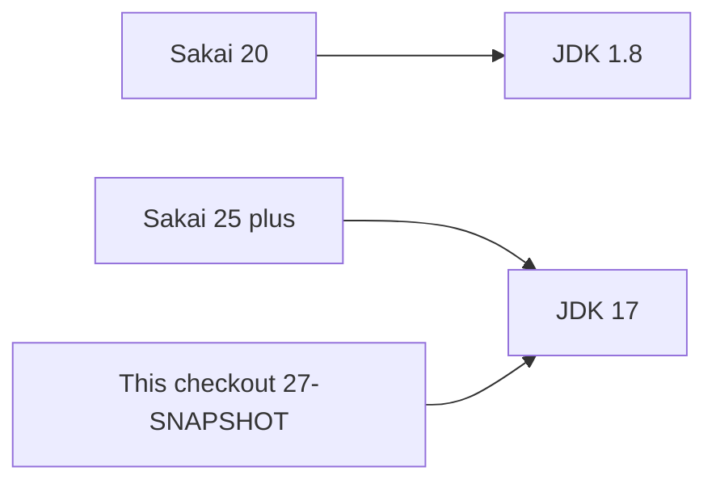

# Versions and compatibility

This checkout is pinned as follows. The numbers come from [master/pom.xml](../master/pom.xml) and the local runtime.

**Compressed runtime is in git** under [`offline-kit/`](../offline-kit/README.md) (split parts under 90MB). [`setup.cmd`](../setup.cmd) unpacks it into `.runtime\` (gitignored). See [Setup and Running Guide.md](../Setup%20and%20Running%20Guide.md).

| Piece | Version |
| --- | --- |
| Sakai product | **27-SNAPSHOT** |
| JDK | **17** |
| Tomcat | **9.0.122** |
| Database (LMS data) | **MariaDB 10.11** |
| Login history only | **MongoDB 7** |
| Optional graph DB (runtime only) | **Neo4j 4.0** |

**Product version** (20, 25, 27-SNAPSHOT) and **JDK version** (8, 17, 21) are different numbers. This tree is the 25+ development line: product 27-SNAPSHOT, language Java 17.

**27** is the next major after community **25**. **SNAPSHOT** means a Maven in-development build, not a numbered release such as 25.2. APIs can still change. Community README lists **25.2** and **23.5** as supported releases; this tree tracks **master after 25**.

## Compatible with this tree

- **JDK 17** for both Maven and Tomcat. Use [env.cmd](../env.cmd) so PATH is the bundled Temurin 17 under `.runtime/jdk`, not a system JDK 21.
- **Tomcat 9** (javax.servlet). The official example image is `tomcat:9-jdk17-temurin` in [docker/Dockerfile.source](../docker/Dockerfile.source).
- **MariaDB 10.11** or a MySQL 8-class server. Hibernate owns the schema; an empty database on first start is expected.
- **MongoDB 7** for login history only (`start.cmd` starts `sakai-mongodb`). See [login-p12-mongodb.md](login-p12-mongodb.md).
- **Neo4j 4.0** container only (`sakai-neo4j`); Sakai does not read/write it yet. Browser: http://127.0.0.1:7474 — user `neo4j` / password `sakai`.
- Maven **3.9.x** (bundled locally). Frontend Node for `webcomponents` is **v22.14.0** in the parent POM.

## Not compatible

- **JDK 8** — that belonged to Sakai **20**.
- **JDK 21 or 25 as `sakai.jdk.version`** — that would be a product change. Leaving a newer JDK on PATH without `env.cmd` can break the build.
- **Tomcat 10+** — Jakarta servlet namespace; not a drop-in for Spring 5 / this tree.
- **A Sakai 20 (or 23 / 25.2) database** pointed at this Tomcat — schemas are not interchangeable without a documented migration.
- **HSQLDB** for a full boot here (Quartz `JOB_DATA` truncation).
- Putting LMS data in MongoDB or Neo4j — LMS data stays in MariaDB; MongoDB is login history only; Neo4j is unused by Sakai code.
- Mixing this tree’s WARs with Sakai 20 JARs (or the reverse).
- Root [README.md](../README.md) install text (“Java 1.8”, “Sakai 24”, Sakai 21 source guide). That file is out of date for this checkout.

`jackson-datatype-jdk8` is a **Jackson 2.x module name** (Java 8 date/time types). It does not mean the project needs JDK 8.

Run **one** Tomcat. A second instance collides on port **8005** and Apache Ignite.

## This checkout vs Sakai 20

| | This checkout | Sakai 20.x |
| --- | --- | --- |
| Product | 27-SNAPSHOT (25+ line) | 20.x (community support ended) |
| JDK | 17 | 1.8 |
| Tomcat | 9.0.122 | 9.x |
| Local run | [Setup and Running Guide.md](../Setup%20and%20Running%20Guide.md) | separate 20 install docs |

## Library pins (appendix)

From `master/pom.xml`. Spring 5 + javax.servlet is why **Tomcat 9 + JDK 17** is the matching pair, not Tomcat 10 or Spring Boot 3.

| Layer | Version |
| --- | --- |
| Spring Framework | 5.3.39 |
| Spring Security | 5.7.14 |
| Spring Data JPA | 2.5.12 |
| Hibernate | 5.6.15.Final |
| Apache Ignite | 2.18.0 |
| Quartz | 2.3.2 |
| Thymeleaf | 3.1.5.RELEASE |
| Jackson | 2.19.2 |
| OpenSearch (optional search) | 2.19.5 |

Back to the [docs index](README.md).
